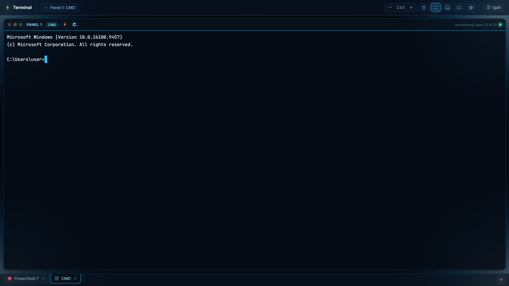
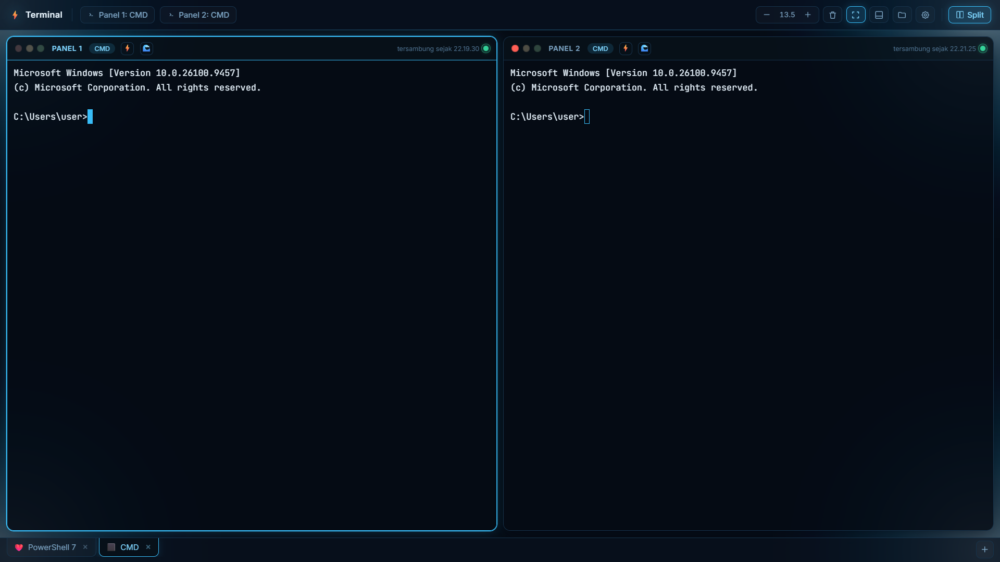
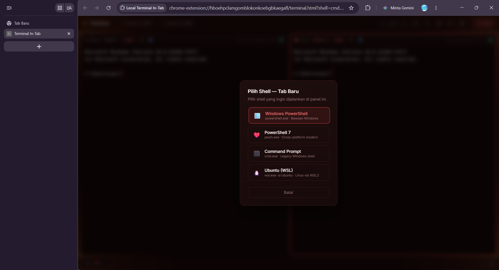

<div align="center">

# ⚡ Local Terminal In-Tab
### *Bawa Kekuatan Terminal Lokal Langsung ke Dalam Browser Anda!*

[](https://developer.chrome.com/docs/extensions/mv3/intro/)
[](LICENSE)
[](#)
[](https://xtermjs.org/)
[](#)

<p align="center">
  <b>Bosan bolak-balik Alt+Tab antara browser dan terminal saat coding atau browsing?</b><br>
  <b>Local Terminal In-Tab</b> adalah ekstensi browser modern bertenaga <b>Chrome Native Messaging Host</b> & <b>Xterm.js</b> yang menghadirkan shell lokal sungguhan (PowerShell, CMD, WSL) langsung di tab browser Anda — lengkap dengan fitur <b>Auto Enter pintar (⚡)</b>, <b>Split Screen ganda (🪟)</b>, dan <b>Multi-Tab multi-shell</b>!
</p>

---
</div>

## 📸 Preview Tampilan

<div align="center">
  <h3>✨ Antarmuka Terminal & Mode Aksi Cepat (Single Pane)</h3>
  
  <br><br>
  <h3>🪟 Mode Split Pane (Multi-Panel Berdampingan)</h3>
  
  <br><br>
  <h3>⚡ Pemilihan Shell & Multi-Tab</h3>
  
</div>

---

## 🌟 Fitur Utama

- **In-Browser Terminal**: Akses command line lokal langsung dari tab browser tanpa perlu beralih aplikasi.
- **Smart Respond & Manual Action Buttons**:
  - ⚡ **Auto Enter/Y (Mode Petir)**: Mendeteksi dan otomatis merespons prompt CLI konfirmasi seperti `(y/n)` atau `[Enter]`. Tersedia opsi **Aman** (melewati prompt yang berisiko/destruktif) dan **Agresif** (langsung auto-respond semua prompt).
  - 🌊 **Kirim Enter Manual (Mode Ombak)**: Mengirimkan sinyal `Enter (\r)` instan ke panel aktif hanya dengan sekali klik tanpa perlu menyentuh keyboard fisik.
- **Split Pane & Multi-Tab**: Buka beberapa sesi tab independen dan split panel berdampingan (side-by-side).
- **Multi-Shell Support**: Beralih mudah antara Windows PowerShell, PowerShell 7, Command Prompt (CMD), dan Ubuntu WSL.
- **Xterm.js Full Support**: Dukungan penuh emulator terminal (ANSI colors, cursor styling, fit addon, copy-paste).
- **Persistent Extension Key**: Menggunakan public key tetap di `manifest.json`, sehingga Extension ID selalu konsisten dan tidak berubah saat reload atau ganti folder.
- **Automated Host Setup**: Skrip instalasi otomatis untuk mendaftarkan Native Messaging Host ke Registry Windows.

---

## ⚡ Mode Aksi Panel (Auto Enter & Enter Manual)

Di setiap header panel terminal, terdapat tombol aksi pintar:

| Tombol | Simbol | Fungsi & Mode | Keterangan |
| :--- | :---: | :--- | :--- |
| **Auto Enter / Y** | ⚡ | **Auto-Respond Prompt CLI** | Klik ikon petir untuk membuka menu pilihan mode:<br>• **Mati (Off)**: Tidak ada respons otomatis.<br>• 🛡️ **Aman (Safe)**: Menjawab prompt konfirmasi standar, otomatis berhenti jika prompt mengandung kata berisiko/destruktif.<br>• ⚡ **Agresif (Aggressive)**: Menjawab otomatis seluruh prompt seketika. |
| **Manual Enter** | 🌊 | **Kirim Enter Instan** | Mengirimkan trigger `Enter` ke shell panel tersebut tanpa harus menekan keyboard fisik. Sangat praktis untuk alur kerja cepat atau input satu tangan. |

---

## 🏗️ Struktur Proyek

```text
terminal-extension/
├── assets/
│   └── screenshots/              # Cuplikan antarmuka & preview
├── host/
│   ├── host.js                   # Node.js Native Messaging host backend
│   ├── host-manifest-template.json # Template manifest Native Host
│   ├── run_host.bat              # Runner batch file untuk host Node.js
│   └── package.json              # Dependency backend host
├── manifest.json                 # Manifest Extension Chrome (V3)
├── popup.html / popup.js         # UI & aksi popup toolbar
├── terminal.html / terminal.js   # Halaman utama terminal in-tab
├── install.bat / install.js      # Installer otomatis Native Messaging Host
├── xterm.js / xterm.css          # Emulator library Xterm.js & styling
└── addon-fit.js                  # Xterm fit addon untuk penyesuaian ukuran otomatis
```

---

## 🚀 Panduan Instalasi

### 1. Prasyarat
- **Google Chrome** / **Microsoft Edge** / browser berbasis Chromium lainnya.
- **Node.js** (LTS direkomendasikan).

### 2. Muat Ekstensi ke Browser
1. Buka browser dan arahkan ke: `chrome://extensions/` (atau `edge://extensions/`).
2. Aktifkan **Developer mode** di pojok kanan atas.
3. Klik tombol **Load unpacked**.
4. Pilih folder `terminal-extension`.

### 3. Daftarkan Native Messaging Host (Windows)
Jalankan file instalasi agar browser diizinkan berkomunikasi dengan terminal lokal:
- Klik dua kali pada file **`install.bat`** (atau jalankan `node install.js` di terminal dengan hak akses yang sesuai).
- Skrip akan membaca ID ekstensi secara otomatis dan mendaftarkannya ke Registry Windows.

---

## 💻 Penggunaan

1. Klik ikon ekstensi **Local Terminal In-Tab** di toolbar browser.
2. Klik **Buka Terminal** untuk meluncurkan terminal di tab baru browser.
3. Gunakan tombol **⚡ (Auto Enter/Y)** atau **🌊 (Enter Manual)** di atas header panel sesuai kebutuhan alur kerja Anda.

---

## 🛡️ Lisensi

Proyek ini dilisensikan di bawah lisensi MIT. Lihat file [LICENSE](LICENSE) untuk detail lebih lanjut.
